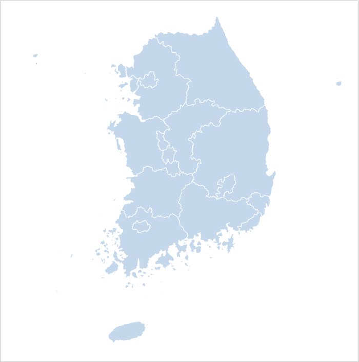

# D3를 이용하여 대한민국 지도 그리기 

프로젝트에서 지도를 그려야할 일이 생겨서 레퍼런스를 찾아보다가 [d3.js](https://d3js.org/)를 이용하여 지도를 그릴 수 있다는 것을 알았다. 일단 그릴 도구는 찾았으니 지도 정보를 가지고 있는 데이터가 필요했다. 

## shp

SHP Foramt(여기서 SHP 포맷이라 함은 shp, shx, dbf로 이루어진 전체 포맷을 의미한다.)   
SHP 포맷은 ESRI ArcView의 Native Format으로 광범위하게 사용되는 GIS(지리정보체계) 포맷이며, 도형정보와 속성정보를 따로 관리한다

shp 포맷은 다음과 같이 3개의 파일로 구성되어 있다.

```
xxx.shp
xxxx.shx
xxxx.dbf
```
* .shp : 도형정보를 담고 있는 파일   
* .shx : 일종의 인덱스 파일로서 shx를 이용하여 프로그래머는 쉽게 shp에 담겨있는 도형정보의 위치를 얻을 수 있다.
* .dbf : shp에 있는 도형정보에 대한 속성정보를 담고 있다.

대한민국의 shp 파일은 아래 링크에서 다운로드를 받을 수 있었다.

> [대한민국 최신 행정구역(SHP) 다운로드](http://www.gisdeveloper.co.kr/?p=2332)

파일을 열어보니 위의 설명 처럼 여러개의 파일이 존재했다. 다만 우리가 필요한 파일은 `.shp` 파일이었는데, 용량이 30MB가 넘어서 웹에서 사용하기엔 적절하지 못하였다.

확인해 보니 웹과 모바일에서 shp 파일을 시각화 하려면 웹의 형식에 맞는 json 또는 xml 포맷으로 변환해 줘야했다.

## 좌표계

삽질을 하면서 알아낸 것인데 위에 링크에서 받은 대한민국 shp파일은 UTM-K(GRS80 타원체) 좌표계를 사용하고 있다. 하지만 내가 표현하고 싶었던 지도는 평면으로 표현되어야하기 떄문에 이 좌표계를 WGS84 좌표계로 변환해야 했다.

## geojson

GeoJSON은 다양한 지리 데이터 구조를 저장하기 위한 포맷이다. 아래의 형태의 구조를 띈다.

```js
{
  "type": "Feature",
  "geometry": {
    "type": "Point",
    "coordinates": [125.6, 10.1]
  },
  "properties": {
    "name": "Dinagat Islands"
  }
}
```

shp파일을 geojson으로 변환하는 방법은 여러가지가 있었지만, 좌표계도 변환해야 했기에 [QGIS](https://www.google.co.kr/search?q=qgis&oq=qgis&aqs=chrome..69i57j69i59j69i60l2j69i59l2.1457j0j4&sourceid=chrome&ie=UTF-8) 툴을 이용했다.

> 3.2 버전은 파이썬 설치가 필요해서 2.18 버전을 다운로드를 받았다.

QIGS를 이용하여 바꿔야하는 점은 크게 3가지 였다.

1. 지도 단순화 [벡터 메뉴 -> 지오메트리 도구 -> 지오메트리 단순화]
2. 좌표계 변환
3. geojson 파일로 저장

너무나 상세한 지도까지는 필요가 없었기에 도형을 단순화 할 필요가 있어서 단순화를 시켰다. (0.5%)

대한민국 전체 지도는 Korea.json, 각 시군구는 지역명.json으로 만들었다.

> [geojson 파일 보기](./src/json)

## 구현하기

```js
import d3 from 'd3'

const mWidth = document.getElementById('map').clientWidth,
  width = 700,
  height = 700,
  initialScale = 5500,
  initialX = -11900,
  initialY = 4050
let centered,
  state

const projection = d3.geo.mercator()
  .scale(initialScale)
  .translate([initialX, initialY])

const path = d3.geo.path()
  .projection(projection)

const svg = d3.select('#map').append('svg')
  .attr('preserveAspectRatio', 'xMidYMid')
  .attr('viewBox', '0 0 ' + width + ' ' + height)
  .attr('width', mWidth)
  .attr('height', mWidth * height / width)

const zoom = xyz => {
  g.transition()
    .duration(650)
    .attr('transform', 'translate(' + width / 2 + ',' + height / 2 + ')scale(' + xyz[2] + ')translate(' + -xyz[0] + ',' + -xyz[1]+ ')')
    .selectAll(['#states'])
    .style('stroke-width', 1.0 / xyz[2] + 'px')
}
const stateClick = d => {
  g.selectAll(".city").remove()
  if (d && state !== d) {
    var xyz = getXyz(d)
    state = d
    d3.json(`../json/${state.properties.CTP_ENG_NM}.json`, json => {
      g.append("g")
        .attr("class", "city")
        .selectAll("path")
        .data(json.features)
        .enter()
        .append("path")
        .attr("id", d => d.properties.name)
        .attr("d", path.pointRadius(20 / xyz[2]))
      zoom(xyz)
    })
  } else {
    state = null
    zoom([width / 2 , height / 2 , 1])
  }
}

const getXyz = d => {
  let x, y, z
  if (d && centered !== d) {
    const bounds = path.bounds(d),
      wScale = (bounds[1][0] - bounds[0][0]) / width,
      hScale = (bounds[1][1] - bounds[0][1]) / height
    z = .96 / Math.max(wScale, hScale)
    x = (bounds[1][0] + bounds[0][0]) / 2
    y = (bounds[1][1] + bounds[0][1]) / 2
    centered = d
  } else {
    x = width / 2
    y = height / 2
    z = 1
    centered = null
  }
  return [x, y, z]
}

svg.append('rect')
  .attr('class', 'background')
  .attr('width', width)
  .attr('height', height)
  .on('click', stateClick)

const g = svg.append('g')
d3.json('../json/Korea.json', json => {
  g.append('g')
    .attr('id', 'states')
    .selectAll('path')
    .data(json.features)
    .enter()
    .append('path')
    .attr('id', d => d.id )
    .attr('d', path)
    .on('click', stateClick)
})
```

해당 폴더를 clone 한 다음 아래의 명령어로 결과를 확인 할 수 있다.

1. 초기 설정

    ```bash
    $ npm install
    ```

2. 코드 수정 후 테스트

    ```bash
    $ npm run dev
    ```

3. 빌드

    ```bash
    $ npm run build
    ```




지도를 클릭하면 해당 시/도의 시군구가 확대된다.

## 참고문헌

* [[SHPViewer 강좌 1] SHP 포맷 분석 1](http://endofcap.tistory.com/3)
* [Interactive Map with d3.js](http://www.tnoda.com/blog/2013-12-07)
* [[javascript] 스프링에서 한국지도 데이터 시각화](https://shj7242.github.io/2018/01/16/geoInfo/)
* [GeoJSON으로 대한민국 시군구읍면동 맵차트 그리기](http://blog.hkwon.me/draw-korean-map-chart-with-geojson/)