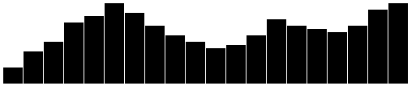
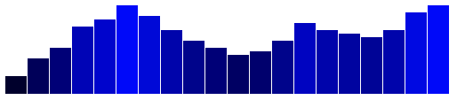
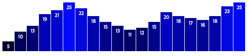
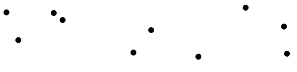
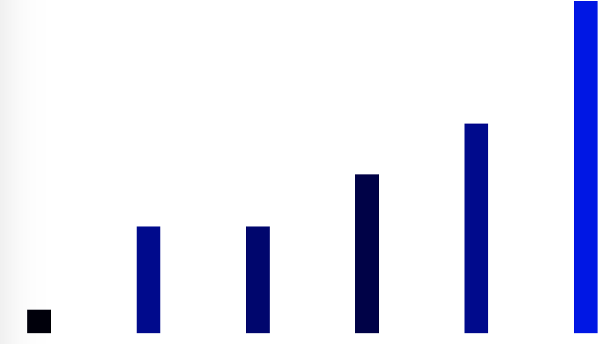
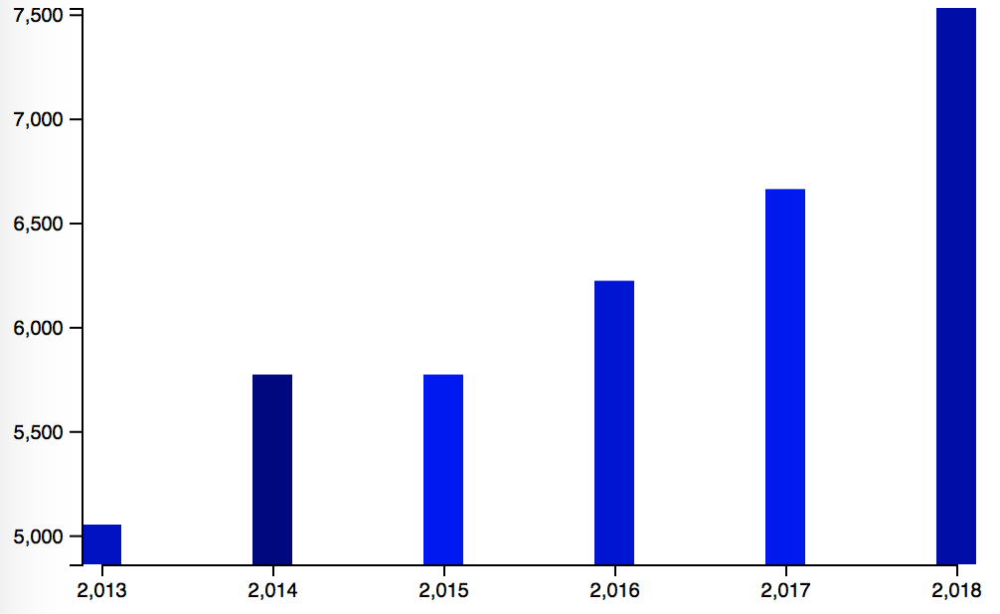

# D3 (Data-Driven Documents)
 
## D3란?
 
D3 (또는 D3.js)은 웹 표준을 사용하여 데이터를 시각화하는 JavaScript 라이브러리이다. D3 은 HTML, SVG 및 CSS를 사용하여 데이터를 실제로 사용할 수 있도록 도와준다. D3은 강력한 시각화 및 상호작용 기술과 DOM 조작에 대한 데이터 기반 접근 방식을 결합하여 최신 브라우저의 모든 기능을 제공하고 데이터에 적합한 시각적 인터페이스를 자유롭게 설계한다.
 
> D3는 `모던 브라우저`를 지원한다. 이 말은 전반적으로 IE8 이전 버전을 제외한 브라우저들을 말한다. D3는 파이어폭스, 크롬(크로미엄), 사파리(WebKit), 오페라, IE9에서 테스트했다. SVG와 CSS3 Transitions를 지원하는 브라우저에서만 동작한다. 만약 사용하는 브라우저가 해당 기능을 지원하지 않는다면 D3는 동작하지 않는다.
 
데이터 시각화 회사인 데이터미어(Datameer)에서는 공식적으로 D3.js를 핵심 기술로서 활용하고 있으며, 뉴욕 타임즈에서는 인터렉티브 기사를 제작할 때 D3.js를 활용해오고 있다. 또한 GeoJSON과 Topojson을 지원하고 있어서 웹에서 지도를 표현할 때도 사용된다.
 
[D3.js 갤러리](https://github.com/mbostock/d3/wiki/Gallery/)
 
 
## 사용하기 
 
### 설치
 
npm을 사용한다면 다음과 같이 설치할 수 있다.
 
```bash
$ npm install d3
```
 
아니면 [최신 릴리즈](https://github.com/d3/d3/releases/latest)를 다운로드할 수 있다. 또한 아래와 같이[d3js.org](https://d3js.org/), [CDNJS](https://cdnjs.com/libraries/d3) 또는 [unpkg](https://unpkg.com/d3/)을 통해 직접적인 로딩이 가능하다.
 
```html
<script src="https://d3js.org/d3.v5.js"></script>
or
<script src="https://d3js.org/d3.v5.min.js"></script>
```
 
D3는 [ES6 모듈](http://www.2ality.com/2014/09/es6-modules-final.html)을 사용하여 작성된다. Webpack이나 사용자가 선호하는 번들러를 통해 묶을 수 있다. D3를 ES6 애플리케이션으로 import하려면 특정 D3 모듈에서 특정 symbol을 가져온다:
 
```js
import {scaleLinear} from "d3-scale";
```
 
또는 namespace를 통해 전부 import할 수 있다. (여기선 `d3`):
 
```js
import * as d3 from "d3";
```
 
## 문법 요소
 
### DOM 선택 (.select(query), .selectAll(query))
 
DOM API를 사용하여 문서를 수정하는 것은 번거롭다. 예를 들어 p 엘리먼트의 텍스트 색상을 모두 빨간색으로 바꾸려면:
 
```js
var paragraphs = document.getElementsByTagName("p");
for (var i = 0; i < paragraphs.length; i++) {
  var paragraph = paragraphs.item(i);
  paragraph.style.setProperty("color", "red", null);
}
```
 
D3에서는 위의 예제를 아래처럼 바꿀 수 있다:
 
```js
d3.selectAll("p").style("color", "red");
```
 
개별 노드도 조작할 수 있다:
 
```js
d3.select("body").style("background-color", "black");
```
 
위의 예제에서는 query로 태그 이름(`p`, `body`)을 사용했지만 class나 id, 속성값을 사용할 수도 있다.
 
### 데이터 연결 (.data)
 
숫자, 문자, 객체를 담은 대부분의 배열을 데이터로 사용할 수 있다.
 
```js
d3.select("body")
  .selectAll("p")
  .data([4, 8, 15, 16, 23, 42])
  .enter().append("p")
  .text("new paragraph!");
```
 
#### CSV 데이터 불러오기
 
CSV란 콤마로 구분된 데이터(Comma Separated Values)를 의미한다. CSV 데이터의 파일 형태는 다음과 같다.
 
```csv
year,age,sex,people
1850,0,1,1483789
1850,0,2,1450376
1850,5,1,1411067
1850,5,2,1359668
```
 
csv의 맨 첫 행은 key가 되는 값이다. 다음 행 부터는 각 key의 매칭되는 value 값이다. 앞의 CSV데이터를 `population.csv`라는 값으로 저장했다고 하면 d3에서 사용하는 방법은 아래와 같다.
 
```js 
d3.csv('population.csv').then(function(data) {
  console.log(data);
}).catch(function(error) {
  console.log(error);
});
```
 
> d3.csv는 비동기 메서드이다. 따라서 브라우저에서 csv 파일을 다운로드가 진행 중인 동안에도 다음 코드가 실행된다.
이는 아직 csv 파일을 모두 불러오지 못하였는데, 데이터 사용이 가능하다고 생각할 수 있는 착각을 일으킨다. 가장 자주 일어나는 일은 콜백 함수 밖에서 csv 파일 데이터를 참조하는 경우이다. 이런 이슈 때문에 되도록이면 콜백 함수 안에서만 데이터를 참조하자.
 
### 속성 적용하기 (.attr)
 
attr()을 통해 문서요소에 HTML 속성과 값을 지정한다. `bar` 클래스 속성을 적용하려면 다음처럼 사용한다.
 
```js
.attr('class', 'bar');
```
 
classed()라는 메서드를 통해 클래스를 좀더 편하게 변경할 수 있다. 위 코드는 아래와 같다.
 
```js
.classed('bar', true);
```
 
ture 값 대신 false를 적용한다면 문서요소에서 `bar` 클래스를 제거한다.
 
### CSS 스타일 적용하기
 
style() 메서드는 HTML 문서요소에 직접 CSS 프로퍼티와 값을 지정할 떄 사용한다. HTML에서 style 속성에 직접 CSS 규칙을 넣는 방법과 동일하다.
 
```js
.style('height', '75px');
```
 
### 동적 속성 적용하기 
 
jQuery와 같은 다른 DOM 프레임 워크에 익숙한 사용자는 D3와의 유사점을 즉시 인식할 수 있다. 그러나 D3는 스타일 및 기타 속성에 단순한 상수 뿐만 아니라 함수를 지정할 수 있다.
 
예를 들어 `p` 엘리먼트를 무작위로 색칠하려면 아래와 같다:
 
```js
d3.selectAll("p").style("color", function() {
  return  'rgb('+ Math.floor(Math.random() * 255) +', '+ Math.floor(Math.random() * 255) + ', '  +  Math.floor(Math.random() * 255)  + ');
});
```
 
짝수 및 홀수 노드의 색상 값을 다르게 주려면 아래와 같다:
 
```js
d3.selectAll("p").style("color", function(d, i) {
  return i % 2 ? "#fff" : "#eee";
});
```
 
data를 사용하면 동적 속성에 특정 값을 전달할 수 있다. data는 배열로 구성되어 있고, 각 값들은 함수의 첫번째 인자(d)로 전달된다. 첫번째 값은 첫번째 앨리먼트에 적용되고 두번째 값은 두번째 앨리먼트에 적용된다. 예를 들어 다음과 같이 `p` 엘리먼트에 숫자 배열을 적용시키면 동적으로 글꼴 크기를 정할 수 있다.
 
```js
d3.selectAll("p")
  .data([4, 20, 65])
    .style("font-size", function(d) { return d + "px"; });
```
 
### .enter()와 .exit()
 
D3의 enter와 exit 선택 항목을 사용하여 데이터에 대한 새 노드를 생성하고 더 이상 필요하지 않은 노드를 제거할 수 있다.
 
데이터와 엮인 **새로운 문서요소**를 생성하려면 enter() 메서드를 사용해야 한다. 이 메서드는 해당 DOM 선택물이 있는지 살펴보고 데이터를 건네준다. DOM 문서요소 보다 데이터 값이 많으면 enter() 메서드는 실제 문서 요소를 가지지 못 하는 것들을 찾아내서 가상의 객체로 만들어 반환해준다.
 
> 간단히 말하면 enter()는 신규 요소들에 대한 선택이다.
 
```js
d3.select("body")
  .selectAll("p")
  .data([4, 8, 15, 16, 23, 42])
  .enter().append("p")
    .text(function(d) { return "I’m number " + d + "!"; });
```
 
[enter 예제](https://codepen.io/ykwan0714/pen/aKvEMy)
 
exit() 메서드는 데이터 보다 많은 문서요소를 선택하는 역할을 한다. remove() 메서드와 함께 사용하면 남는 요소를 지울 수 있다.
 
```js
var p = d3.select("body")
  .selectAll("p")
  .data([1, 2, 4, 8, 16, 32])
  .text(function(d) { return d; });
 
p.exit().remove();
```
 
[exit 예제](https://codepen.io/ykwan0714/pen/eKpyag)
 
 
 
## 간단한 차트 만들기
 
### div로 드로잉 하기
 
데이터를 이용해서 간단한 막대 차트를 만들어 보자. HTML의 div 엘리먼트로 간단한 사각형 모양을 만들 수 있다.
 
[예제 링크](https://bit.ly/2IQdu0F)
 
```html
<!DOCTYPE html>
<html>
<head>
  <meta charset="utf-8">
  <title>D3.js</title>
  <script src="https://d3js.org/d3.v5.min.js"></script>
  <style>
  .bar {
	  display: inline-block;
	  width: 20px;
	  height: 75px;
	  background-color: teal;
	  margin-right: 2px;
  }
  </style>
</head>
<body>
</body>
</html>
```
```js
var dataset = [5, 15, 10, 25, 20];
 
d3.select('body').selectAll('div')
.data(dataset)
.enter()
.append('div')
.attr('class', 'bar')
.style('height', function(d) {
  return d * 5 + 'px'
});
```
 
> selectAll()은 아직 존재하지 않는 div에 대한 빈 참조를 반환하고, data()는 생성할 문서요소에 데이터를 바인딩하며, enter()는 바인드된 데이터들 중에 아직 실제 문서 요소를 가지지 못 하는 것들을 찾아내서 가상의 객체로 만들어 반환한다. 그러고 나서 append()가 DOM에 div를 추가한다.
 
### svg로 드로잉 하기 
 


[예제 링크](https://codepen.io/ykwan0714/pen/rKOJLz)
 
```html
<!DOCTYPE html>
<html>
<head>
  <meta charset="utf-8">
  <title>D3.js</title>
  <script src="https://d3js.org/d3.v5.min.js"></script>
</head>
<body>
</body>
</html>
```
```js
var w = 500;
var h = 100;
 
var dataset = [15, 10, 25, 5, 20, 22, 18, 15, 32, 22, 7, 3, 40];
 
var svg = d3.select('body').append('svg');
svg.attr('width', w);
svg.attr('height', h);
 
svg.selectAll('rect')
  .data(dataset)
  .enter()
  .append('rect')
  .attr('x', function(d, i) {
    return i * 21; // 막대 사이의 간격을 주려고 막대 폭 20에 1을 더함
  })
  .attr('y', function(d) {
    return h - d * 2; // svg는 모두 좌측 상단이 기준이다. svg 높이에서 해당 rect의 높이를 빼줘야한다.
  })
  .attr('width', 20)
  .attr('height', function(d) {
    return d * 2;
  });
```
 
#### 색상 추가 하기


 
```js
.attr('fill', function(d) {
    return 'rgb(0, 0, ' + (d*10) + ')';
});
```
 
> **여러 값을 한번에 매핑하기**
> 
> 외부 library가 필요하다. https://github.com/d3/d3-selection-multi
> 
> ```html
> <script src = "https://d3js.org/d3-selection-multi.v1.min.js"></script>
> ```
> ```
> svg.select('circle')
>    .attrs({
>      cx: 0,
>      cy: 0,
>      fill: red
>    });   
> ```
 
#### 라벨 추가 하기


 
```js
svg.selectAll('text')
  .data(dataset)
  .enter()
  .append('text')
  .text(function(d) {
    return d;
  });
```
 
[최종 결과물](https://codepen.io/ykwan0714/pen/rKOJKd)
 
 
### 산포도 만들기 
 
지금까지는 한 가지 기준에 해당하는 값들의 집합인 1차원 데이터를 이용하여 막대 차트를 그렸다. 하지만 서로 다른 의믜를 가진 두 개의 데이터 집합을 가지고 있다면, 차원이 두개 필요하다. 산포도(scatterplot)은 가로, 세로 두개의 축(x, y) 위에 관련된 두 값을 표현하는 시각화 중 가장 일반적인 방법이다.


 
[예제 링크](https://codepen.io/ykwan0714/pen/jKbzMZ)
 
```html
<!DOCTYPE html>
<html>
<head>
  <meta charset="utf-8">
  <title>D3.js</title>
  <script src="https://d3js.org/d3.v5.min.js"></script>
</head>
<body>
</body>
</html>
```
```js
var w = 500;
var h = 100;
 
var dataset = [
	[5, 20],
	[480, 90],
	[250, 50],
	[100, 33],
	[330, 95],
	[410, 12],
	[475, 44],
	[25, 67],
	[85, 21],
	[220, 88]
];
 
var svg = d3.select('body').append('svg')
    .attr('width', w)
    .attr('height', h);
 
svg.selectAll('circle') // rect가 아니다
  .data(dataset)
  .enter()
  .append('circle') // 원을 그리는데 필요한 cx, cy, r이 사용된다.
  .attr('cx', function(d) { 
    return d[0];
  })
  .attr('cy', function(d) {
    return d[1];
  })
  .attr('r', 5);
```
 
### Scale (척도)
 
Scale(척도)는 입력되는 domain(정의역)과 출력되는 range(치역)을 매핑한 함수를 말한다.
 
> 수학에서 사용하는 일반적인 함수에 대한 정의. y=f(x)에서 x가 될 수 있는 값을 domain이라고 하고, domain에 따라 출력되는 y가 될 수 있는 값을 range라고 한다.
 
d3에서 척도는 사용자가 정의한 파라미터를 가지고 있는 함수다. 척도를 생성한 후에 데이터 값을 넘겨 호출하면 비율이 바뀐 출력 값으로 반환한다.
 
#### 정의역과 치역
 
척도에서 정의역(input domain)은 입력가능한 데이터 값의 범위를 말한다. 예제를 들어 살펴 보자. 아래의 데이터 집합은 가게의 월별 사과 판매량이다.
 
```js
var dataset = [ 100, 200, 300, 400, 500 ];
```
 
위 데이터에서 적절한 정의역은 100 ~ 500 또는 0 ~ 500이 된다.    
척도에서 치역(output range)은 화면에 출력하기 위한 데이터 값의 범위이고 단위는 픽셀이다.   
정의역이 [100, 500]이고 치역이 [10, 350]인 척도를 생성해보자. 이 척도는 정의역의 최솟값인 100을 전달하면, 치역의 최솟값인 10을 반환하고, 500을 전달하면 350을 반환한다.
 
```js
var scale = d3.scaleLinear();
scale(2.5) // 2.5를 반환한다.
```
위의 예제는 아직 정의역을 설정하지 않았으므로 이함 수는 입출력을 1:1 비율로 매핑한다.
정의역은 .domain 치역은 .range()로 설정할  수 있다.
 
```js
var scale = d3.scaleLinear();
scale.domain([100, 500])
    .range([10, 350]);
scale(100); // 10을 반환한다.
scale(500); // 350을 반환한다.
```
정의역에서 최솟값, 최대 값을 꼭 집어서 지정하는 대신, 데이터 집합을 분석하는 배열 함수 d3.max(), d3.min()을 사용할 수 있다.
 
```js
var simpleDataset = [7, 8, 4, 5, 2];
d3.max(simpleDataset); // 8을 반환한다.
```
 
보다 시피 1차원 배열을 비교할 때  max() 함수는 배열의 값을 순회하면서 최대 값을 찾는다.   
하지만 2차원 배열일 경우는 어떨까?
 
```js
var simpleDataset = [[5, 20], [100, 33], [330, 95], [85, 21]];
d3.max(simpleDataset); // [85, 21]을 반환한다.
```
 
어떤 기준을 가지고 반환된 것인지 잘 모르겠다.  비교할 값을 지정해서 max()를 호출하렴면 두번째 전달인자인 접근하 함수가 필요하다.
 
```js
var simpleDataset = [[5, 20], [100, 33], [330, 95], [85, 21]];
d3.max(simpleDataset, function(d) {
	return d[0]; // 첫번째 인자로 비교하겠다.
}); // 330을 반환한다.
```
 
척도 함수는 홀로 사용되기 보다는, 보통 attr() 메서드 안에서 호출된다. 이제 척도를 사용하여 그래프를 수정해 보자.


 
[scale 예제](https://codepen.io/ykwan0714/pen/gKPZyd)
 
```js
var width = 500;
var height = 300;
var dataset = [[2013, 4860], [2014, 5580], [2015, 5580], [2016, 6030], [2017, 6470], [2018, 7530]];
 
var xScale = d3.scaleLinear();
xScale.domain([d3.min(dataset, function(d) {
	return d[0]; 
}), d3.max(dataset, function(d) {
	return d[0];
})])
    .range([20, width-20]);
 
var yScale = d3.scaleLinear();
yScale.domain([d3.max(dataset, function(d) {
	return d[1];
}), d3.min(dataset, function(d) {
	return d[1];
})])
    .range([height-20, 20]);
 
 
var svg = d3.select('body').append('svg');
svg.attr('width',width);
svg.attr('height', height);
 
svg.selectAll('rect')
  .data(dataset)
  .enter()
  .append('rect')
  .attr('x', function(d, i) {
    return xScale(d[0]);
  })
  .attr('y', function(d) {
    return height - yScale(d[1]);
  })
  .attr('width', 20)
  .attr('height', function(d) {
    return yScale(d[1])
  })
  .attr('fill', function(d) {
    return 'rgb(0, 0, ' + Math.floor(Math.random() * 255) + ')';
});;
 
 
```
 
## axis(축)
 
축은 척도와 형태가 거의 유사하다. 축은 여러분이  정의한 파라미터를 가진 함수다. 척도와 다른 점은, 축은 함수를 호출하면 어떤 값을 반환하는 대신에 선과 라벨같은 시각적 요소가 생성된다.
 
### 생성하기 
 
x축은 .axisBottom() y축은 .axisLeft()를 통해 생성할 수 있다. 축에는 어떤 척도를 다뤄야하는지 반드시 알려줘야한다.
 
```js
var xAxis = d3.axisBottom(xScale);
var yAxis = d3.axisLeft(yScale);
```



[axis 예제](https://codepen.io/ykwan0714/pen/mKVvEz)
 
 
### 
 
## 참고문헌
* [d3.js 공식 홈페이지](https://d3js.org/)
* [d3 wiki](https://github.com/d3/d3/wiki)
* [d3 위키백과](https://ko.wikipedia.org/wiki/D3.js)
* [쉽고 빠른 인터렉티브 데이터 시각화](http://www.aladin.co.kr/shop/wproduct.aspx?ItemId=38304166)