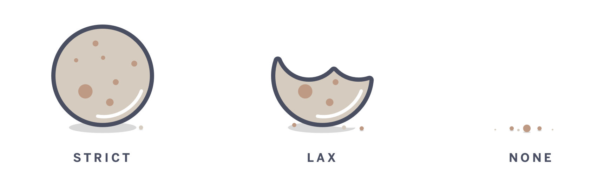

# SameSite=None, Secure Cookie Settings

크롬은 2020년 2월에 릴리즈된 크롬 80버전(2월 4일)부터 새로운 쿠키정책인 `SameSite=None;`과 `Secure Cookie Setting`을 추가했다.

> 원문: [Developers: Get Ready for New SameSite=None; Secure Cookie Settings](https://blog.chromium.org/2019/10/developers-get-ready-for-new.html)
> 번역:  [개발자를 위한 새로운 SameSite=None; 보안 쿠키 설정에 대비하기](https://developers-kr.googleblog.com/2020/01/developers-get-ready-for-new.html) 

해당 업데이트로 인해 쿠키와 관련된 작업들에 큰 영향을 미칠 것으로 예상되는데, 그 중 다른 사이트의 쿠키를 참조하는 PG사(이니시스, KCP, 나이스페이, Paypal등)을 통한 결제에 영향을 주는 것으로 파악되었다. 관련하여 공지도 내려왔다.

> 참조: [[공지] 크롬 80 업데이트에 따른 변경사항 및 가이드 안내](https://www.inicis.com/blog/archives/121508) - KG이니시스


웹 페이지 상의 외부 리소스가 사이트 도메인과 일치하지 않는 쿠키에 접근할 때, 이를 `cross-site` 또는 `third party` 컨텍스트라고 한다. 반대로 웹 페이지 상의 리소스가 유저가 접속한 사이트와 일치하는 쿠키에 접근한 경우, 이를 `same-site` 또는 `first-party` 컨텍스트라고 한다.


## SameSite 속성



크로미움 사이트의 SameSite 속성의 정책을 보면 아래와 같이 요약되어 있다.

-   A cookie with `"SameSite=Strict"` will only be sent with a same-site request.
-   A cookie with `"SameSite=Lax"` will be sent with a same-site request, or a cross-site top-level navigation with a "safe" HTTP method.
-   A cookie with `"SameSite=None"` will be sent with both same-site and cross-site requests.

> 출처:[Cookie Legacy SameSite Policies](https://www.chromium.org/administrators/policy-list-3/cookie-legacy-samesite-policies)

앞으로 SameSite 속성을 지정하지 않은 모든 쿠키는 자동으로 SameSite = Lax 사용된다.
-   기존 : SameSite=None
-   변경 : SameSite=Lax

### Strict 

이 설정을 사용하는 쿠키는 처음에 설정된 도메인(same-site)을 방문할 때만 액세스할 수 있다. 즉, Strict는 쿠키를 사이트 간에 사용할 수 없게 차단한다.이 옵션은 은행과 같이 보안이 높은 애플리케이션에 가장 적합하다.

### Lax 

이 설정을 사용하는 쿠키는 Strict에서 몇가지 예외처리가 추가된 정책이다. same-site 요청과 더불어 HTTP GET 요청과, 최상위 네비게이션 동작에만 쿠키가 포함되어 전송된다. 여기서 최상위 네비게이션이란 이 탐색으로 인해 주소 표시 줄의 URL이 변경되는 것을 의미한다. 따라서 이 옵션은 타사에서 쿠키를 사용할 수 있지만 CSRF 공격의 피해를 당하지 않도록 하는 보안 혜택이 추가된 경우에 사용된다. 

> 최상위 탐색 
> 
> 요청 타입 | 예제 
> ---|---
> link | `<a href="…">`
> prerender | `<link rel="prerender" href="…">`
> form get | `<form method="get" action="…">`

또한 Lax는 SameSite 속성 값을 추가하지 않으면 기본적으로 자동으로 추가되는 값이다.

```text
// if you set..
Set-Cookie: test_cookie=1
// will be
Set-Cookie: test_cookie=1; SameSite=Lax
```

### None

이 설정을 사용하는 쿠키는 이전에 쿠키가 작동하는 방식과 동일하게 작동한다. 쿠키 사용에 있어서 소스가 되는 주소를 검증하지 않는다. 그러나 Secure 옵션을 설정하지 않으면 쿠키 생성이 불가하다.

```text
// rejected!
Set-Cookie: test_cookie=1; SameSite=None
// should be
Set-Cookie: test_cookie=1; SameSite=None; Secure
```

## same-site, cross-site의 구분 기준

same-site, cross-site 구분은 어떠한 형태로 구분할까? site의 의미를 정확하게 이해하면 도움이 된다. site는 도메인 접미사와 도메인 바로 앞의 일부가 결합된 것이다. 예를들어  `wwww.web.dev`도메인은  `web.dev`  site의 일부이다.

[공개 접미사 목록](https://publicsuffix.org/)에서 이를 정의한다.  `.com`과 같은 최상위 도메인 뿐만 아니라,  `github.io`와 같은 서비스도 포함된다. 공개 접미사 목록을 사용하는 소프트웨어는 쿠키를 설정할 수 있는 위치와 설정하지 않을 수 있는 위치를 결정하여 사이트 간에 사용자를 추적할 수 없도록 보호할 수 있다. 예를들자면  `your-project.github.io`와  `my-project.github.io`을 별도의 사이트로 판단하게 만드는 것이다.

> `your-project.github.io`에 있는 사용자가  `my-project.github.io`에 위치한 이미지를 요청하면, 이는  **cross-site**  요청이다.


## 출처

- [개발자를 위한 새로운 SameSite=None; 보안 쿠키 설정에 대비하기](https://developers-kr.googleblog.com/2020/01/developers-get-ready-for-new.html) 
- [preventing-csrf-with-samesite-cookie-attribute](https://www.sjoerdlangkemper.nl/2016/04/14/preventing-csrf-with-samesite-cookie-attribute/)
- [Samesite Cookies Explained](https://web.dev/samesite-cookies-explained/)
- [Chrome's Changes Could Break Your App: Prepare for SameSite Cookie Updates](https://blog.heroku.com/chrome-changes-samesite-cookie)
- [SameSite Examples](https://github.com/GoogleChromeLabs/samesite-examples)
